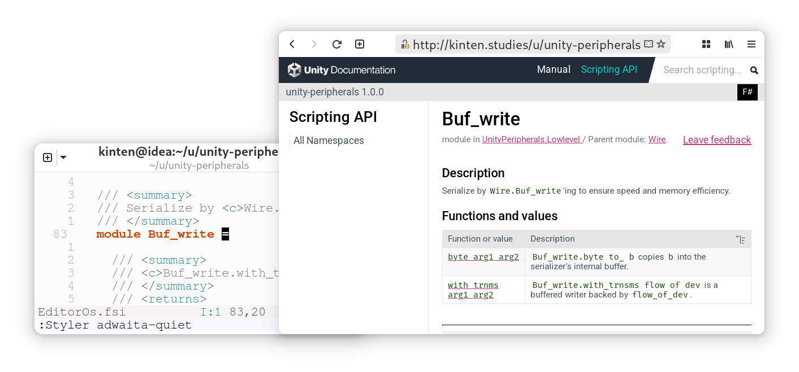

**`Unity.FSharp.Formatting`** is the (unofficial) Unity Documentation Theme for the FSharp.Formatting documentation generator. For use with F#-based Unity projects.



[Live preview of this repository's documentation](https://ttb-hcmut.github.io/Unity.FSharp.Formatting/manual/index.html)

Features:
 
- Separation between Scripting API a.k.a. API Reference pages, and Manual a.k.a. Documentation pages. A Scripting API page may have a counterpart Manual page (and vice versa), and the website will detect this and show a "Switch to Manual" button.
- Sidebar is a tree view of all namespaces and their hierarchy. This is inspired by how Unity Documentation works and is quite "new" to fsdocs.
- User interface is a clone of that of Unity Documentation, painstakingly **recreated through eye-balling**. All details are preserved, including branding placements and service advertisements (template user can opt out).
- Function as a conventional, well-form fsdocs documentation website, including: namespace documentation, description summary and expand, on-hover definitions, etc.
- Local-first. All assets are self-hosted, website can be launched in localhost off-line. This is unlike the default template of fsdocs which requires downloading remote font assets from Google Fonts.

Comparison

Variants

## Installation

### As a Unity package

### Standalone

## Programming

## Development

```bash
dotnet tool install --global fsdocs-tool
```

```bash
dotnet tool exec fsdocs-tool build --output _www --parameters root /Unity.FSharp.Formatting/
```
